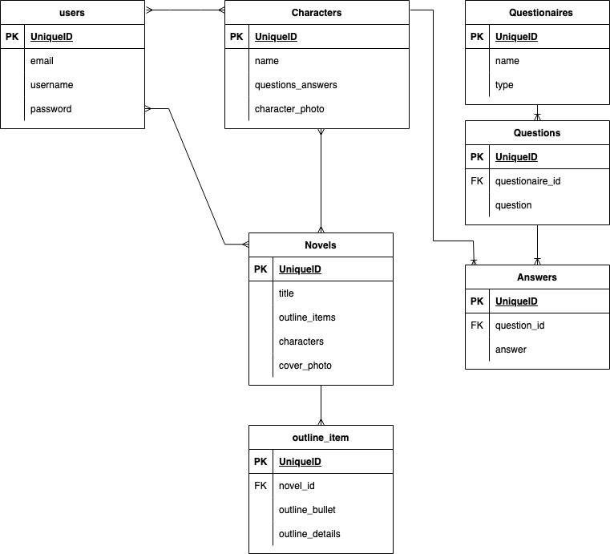
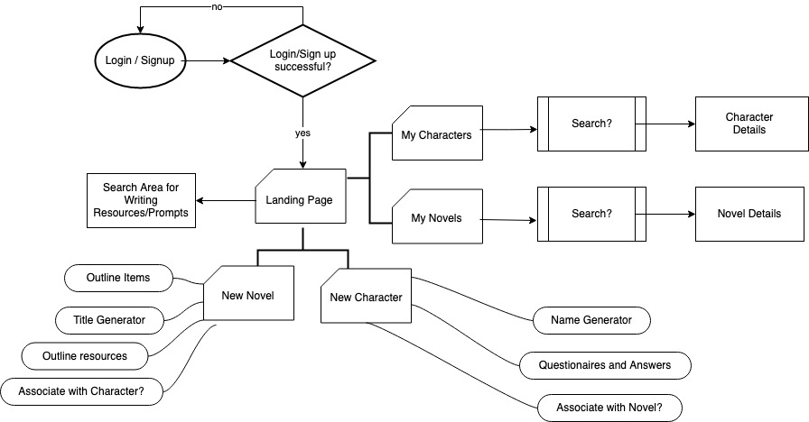

# Novel Writing and Character Building Tool Website

**Project Proposal**

## Overview

A tool for fleshing out original fiction characters or outlines for a novel. There are numerous character and novel worksheets for outlining characters and stories, but often not every question or item in a worksheet will apply to a given story or character. For some writer's it's rather annoying to have to print out, edit pdf questionaires, and/or keep track of outlines and character profiles. The goal of this project is to provide a useful answer to these problems, and way for writers to explore their ideas.

## Tech Stack

React, Node JS, PostgreSQL, with focus slanted toward front-end, but definitely a full-stack application.

## Data

Multiple prebuilt APIs may be used for this app - certain data such as the questionaire data will likely need to be built into an API of my own making.

Data for questionaires will be sourced from the [Proust](https://web.archive.org/web/20121225100330/http://www.chick.net/proust/question.html), [Bernard Pivot, and James Lipton questionaires](https://www.deschuteslibrary.org/files/uploads/Bernard%20Pivot%20and%20James%20Lipton%20Questionnaires.pdf), as well as a character analysis sheet from a site called [MousePawMedia](https://mousepawmedia.com/downloads/writing/CharacterAnalysis.pdf).

Example story structure for limited help with outlines could use a structure like [The Hero's Journey](https://en.wikipedia.org/wiki/Hero%27s_journey) templates.

Name generation could be handled by something such as [this API](https://fungenerators.com/api/namegen/), or I could build one in with popular names from US census data.

Writing prompts could also be included at some point, [by an already made API](https://generatorfun.com/writing-prompt-api) or via web scraping.

Google or YouTube search API could be utilized for finding other writing resources not supplied in the other options.

## Demographic

Fiction writers of almost any genre or medium.

## Tenative Schema

## Possible Issues

Not enough variety in names generated.
Allowing for picking/choosing of individual questions/answers to fill out and add to a profile could get messy. Some data, if I end up using a web scraper could also be messy to clean up, and with writing prompts especially there are copyright considerations.

## Sensitive Info

Passwords will need to be secured with Bcrypt. User's novel outlines/characters profiles should only be accessible by the user who created it.

## Functionality

- Functions to help build character profiles and notes

- Functions to help build novel outlines, synopses, notes and ability to associate them with characters. Characters do not have to be associated with a novel at all, but can also be associated with multiple novels.

- Function to search novels and characters the user has created.

- Responses to writing prompts if implemented will not be kept in app's database - no full blown writing will be done in the app.

- Easy access to writing resources, and a way to search for writing resources elsewhere.

## User Flow

## Stretch/Long Term Goals for additional features

I want to continue to build on this tool and add more creative functionality, such as:

- Personality tests for characters. Out of the box, personality test related APIs are pricy, but I did find [this guide](https://www.riddle.com/blog/enneagram-test-create-your-own/) which could be used to come up with something even less exact, but similiar.

- Random writing prompt generator

- Ability to create multiple iterations of the same character or novel outline, without losing the current iteration.

- In light of some comments from my cohort, it could be useful to add a functionality where teachers can see/comment on their students' story outlines / character profiles.
