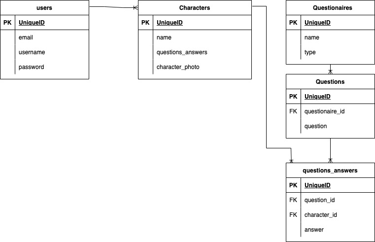

# WritSandbox Frontend

## Deployed on Surge

https://writbox.surge.sh/

## Description

A tool for writers. Ditch the pen/paper - build out your fictional characters' descriptions, personalities, and histories for your next novel in one convenient place.

With WritSandbox you can get to know your characters with 4 different character worksheets and 138 available questions to 'ask' your characters before you start writing.

## Features

- Create characters and attach interview questions and answers to their profile
- Name generation for those who don't know what to name a character yet upon creation of the character or later on. Users can choose to have random name generated that is one of the following: traditionally male, female, or gender neutral names, or to be surprised with a completely random name.
- Questionaire / Question Search, sort by question category or questionaire
- Smooth Creating and Editing of characters and answers, no leaving the page to edit or add questions/answers to a characters profile.
- Easy deletion of characters and answers
- Ability to update contact details, username, and password

## APIs

- For character name generation: https://api-ninjas.com/api/babynames in conjuction with Falso for rounded out name generation: https://ngneat.github.io/falso/docs/getting-started
- Homemade Character Questionaire API (completed and deployed, [see separate repo for full documentation](https://github.com/KiaMorelos/Backend-NovelCharacterWritingApp)) which contains questionaire data from the following resources: [Proust](https://thewritepractice.com/proust-questionnaire/), [Bernard Pivot, and James Lipton questionaires](https://www.deschuteslibrary.org/files/uploads/Bernard%20Pivot%20and%20James%20Lipton%20Questionnaires.pdf), as well as a character analysis sheet from a site called [MousePawMedia](https://mousepawmedia.com/downloads/writing/CharacterAnalysis.pdf).

## Techonologies

React, Node/Express backend with Sequelize, POSTGRES, React-Boostrap 5.2 with FontAwesome for icons, Axios, and JSON Web Tokens

## User Flow

- Login or Signup
- Create a character, or multiple characters without ever leaving the create character form.
- Search Questionaires / Questions
- Add Questions / Answers without having to leave the search area, or choose to go back to the character being worked on when done to review the profile
- Edit or Delete answers without ever leaving the character page
- Edit the character's name or photo
- Delete the character from their page, be redirected to general list of characters

## Schema

## Getting Started with Create React App

This project was bootstrapped with [Create React App](https://github.com/facebook/create-react-app).

## Available Scripts

In the project directory, you can run:

### `npm start`

Runs the app in the development mode.\
Open [http://localhost:3000](http://localhost:3000) to view it in your browser.

The page will reload when you make changes.\
You may also see any lint errors in the console.

### `npm test`

Launches the test runner in the interactive watch mode. Tests for components are contained in the component folder they belong to.
See the section about [running tests](https://facebook.github.io/create-react-app/docs/running-tests) for more information.

### `npm run build`

Builds the app for production to the `build` folder.\
It correctly bundles React in production mode and optimizes the build for the best performance.

The build is minified and the filenames include the hashes.\
Your app is ready to be deployed!

See the section about [deployment](https://facebook.github.io/create-react-app/docs/deployment) for more information.

### `npm run eject`

**Note: this is a one-way operation. Once you `eject`, you can't go back!**

If you aren't satisfied with the build tool and configuration choices, you can `eject` at any time. This command will remove the single build dependency from your project.

Instead, it will copy all the configuration files and the transitive dependencies (webpack, Babel, ESLint, etc) right into your project so you have full control over them. All of the commands except `eject` will still work, but they will point to the copied scripts so you can tweak them. At this point you're on your own.

You don't have to ever use `eject`. The curated feature set is suitable for small and middle deployments, and you shouldn't feel obligated to use this feature. However we understand that this tool wouldn't be useful if you couldn't customize it when you are ready for it.

## Learn More

You can learn more in the [Create React App documentation](https://facebook.github.io/create-react-app/docs/getting-started).

To learn React, check out the [React documentation](https://reactjs.org/).

### Code Splitting

This section has moved here: [https://facebook.github.io/create-react-app/docs/code-splitting](https://facebook.github.io/create-react-app/docs/code-splitting)

### Analyzing the Bundle Size

This section has moved here: [https://facebook.github.io/create-react-app/docs/analyzing-the-bundle-size](https://facebook.github.io/create-react-app/docs/analyzing-the-bundle-size)

### Making a Progressive Web App

This section has moved here: [https://facebook.github.io/create-react-app/docs/making-a-progressive-web-app](https://facebook.github.io/create-react-app/docs/making-a-progressive-web-app)

### Advanced Configuration

This section has moved here: [https://facebook.github.io/create-react-app/docs/advanced-configuration](https://facebook.github.io/create-react-app/docs/advanced-configuration)

### Deployment

This section has moved here: [https://facebook.github.io/create-react-app/docs/deployment](https://facebook.github.io/create-react-app/docs/deployment)

### `npm run build` fails to minify

This section has moved here: [https://facebook.github.io/create-react-app/docs/troubleshooting#npm-run-build-fails-to-minify](https://facebook.github.io/create-react-app/docs/troubleshooting#npm-run-build-fails-to-minify)
